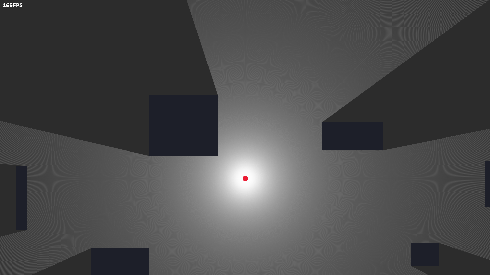
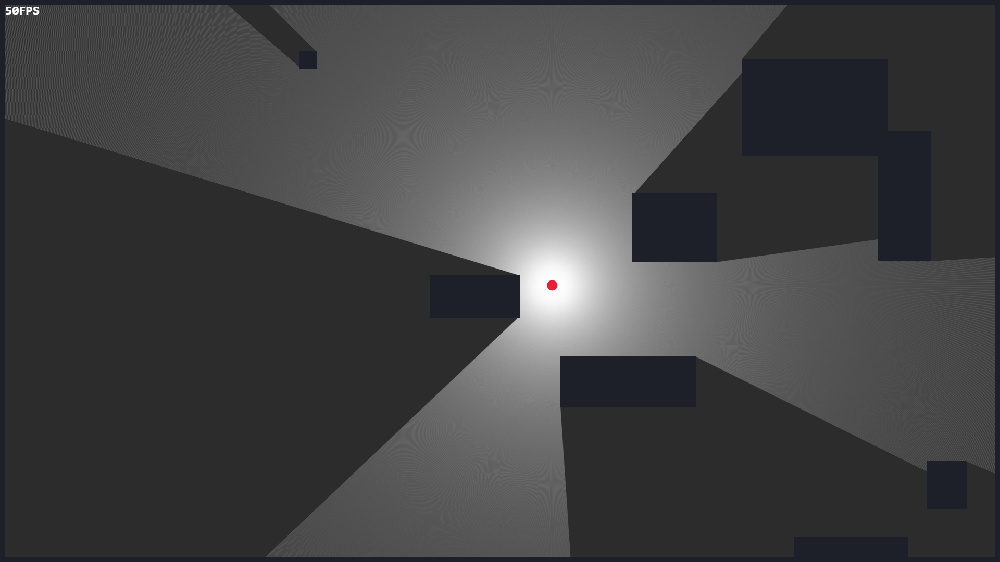
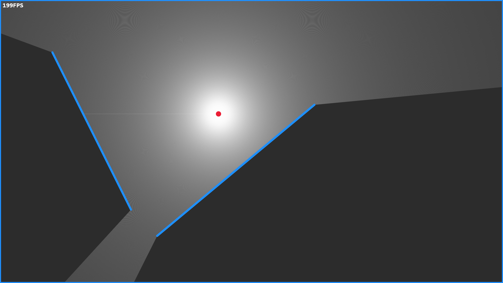
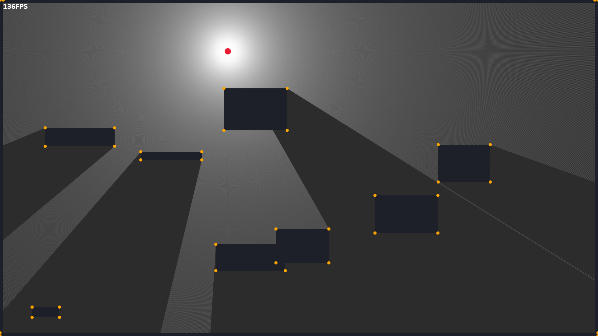

# Raycast Tests 
Just some experiments to do with raycasting in JavaScript.

4 Modes are included. They were each made at different times and have varying levels of performance.
The modes:
 - [Box](#Box)
 - [Simple Box](#Simple-Box)
 - [Line](#Line)
 - [Broken Line](#Broken-Line)

> *Links to try each mode can be found below!*

## Box
### [Try it online!](https://lebster.xyz/projects/sg/play/raycast?mode=box)
Boxes are randomly generated on page load. Every box on the screen is represented by 4 line segments internally.

Raycasting is done by checking the intersection of every ray with each line segment of each box, and setting the length of the ray to stop at the closest intersecting line segment.



## Simple Box
### [Try it online!](https://lebster.xyz/projects/sg/play/raycast?mode=sbox)
Boxes are randomly generated on page load. Every box on the screen only stores its `x`, `y`, `width`, and `height` values.

Raycasting in this mode is done using the following algorithm:
```python
for every ray:
    for every box:
        if ray is colliding with box:
            next ray
    
    ray.length += cast_precision
```

> This of raycasting method is a lot slower than testing for line segment intersections, so the FPS on this mode is considerably lower than on all the other modes.



## Line
### [Try it online!](https://lebster.xyz/projects/sg/play/raycast?mode=line)
Similar to the [Box](#Box) mode, except instead of boxes the map consists of two static line segments.



## Broken Line
### [Try it online!](https://lebster.xyz/projects/sg/play/raycast?mode=bline)
This mode is similar the [Box](#Box) mode, however the code is a lot messier.

The raycasting in this mode is broken because it sets the end of every ray to the first box that it intersects with, rather than after the closest box.

